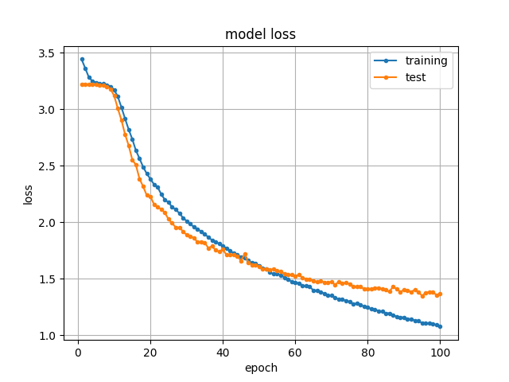
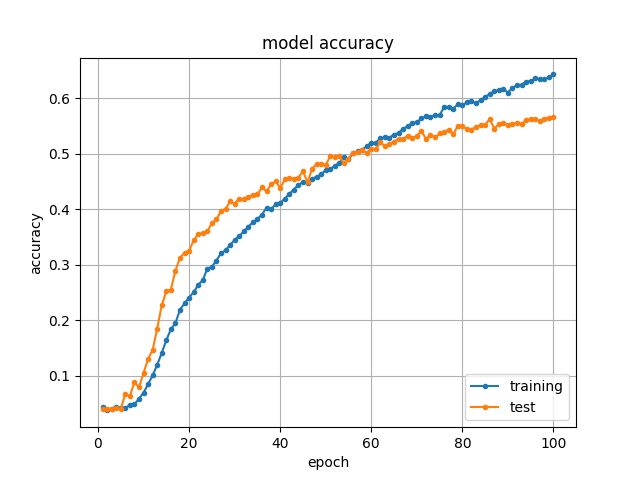

3D-CNN for Lip Reading Challenge 2019
===

## Description

Implementation a baseline method by 3D Convolutional Neural Network (3D-CNN) for Lip Reading Challenge 2019 (LR-Challenge2019).
LR-Challenge2019 is a competition for lip reading technology organized by our research group.

## Dataset

The dataset of LR-Challenge2019 is SSSD, released by our research group, and can be found at [SSSD](http://www.slab.ces.kyutech.ac.jp/SSSD/index_en.html). This dataset provides pairs of lower half face ROI (LF-ROI) images and 68 facial feature points, these are collected from 72 speakers using smart device. The speech contents is 25 Japanese words: 10 digit words and 15 greeting words.

A sample of LF-ROI is shown below. This is a movie saying /a-ri-ga-to-u/ (thank you) in Japanese. The image size of LF-ROI is 300x300 [pixel]. The frame rate is approx. 30fps.

## Architecture

The arthiceture of the baseline 3D-CNN is shown below. All LF-ROIs are resized from 300x300 [pixel] to 32x32 [pixel].

| Layer (type) | Output Shape |
----|----
|conv3d_1 (Conv3D)            | (32, 32, 25, 32) |
|activation_1 (Activation)    | (32, 32, 25, 32) |
|conv3d_2 (Conv3D)            | (32, 32, 25, 32) |
|activation_2 (Activation)    | (32, 32, 25, 32) |
|max_pooling3d_1 (MaxPooling3 | (11, 11, 9, 32)  |
|dropout_1 (Dropout)          | (11, 11, 9, 32)  |
|conv3d_3 (Conv3D)            | (11, 11, 9, 64)  |
|activation_3 (Activation)    | (11, 11, 9, 64)  |
|conv3d_4 (Conv3D)            | (11, 11, 9, 64)  |
|activation_4 (Activation)    | (11, 11, 9, 64)  |
|max_pooling3d_2 (MaxPooling3 | (4, 4, 3, 64)    |
|dropout_2 (Dropout)          | (4, 4, 3, 64)    |
|flatten_1 (Flatten)          | (3072)           |
|dense_1 (Dense)              | (512)            |
|dropout_3 (Dropout)          | (512)            |
|dense_2 (Dense)              | (25)             |

## Experimental conditions and result

At first, download all LF-ROIs of SSSD.

- Input data: LF-ROI (32x32 [pixel])
- Training data: 25 words x 54 speakers x 10 samples = 13,500 samples. See **training_LF-ROI.txt**
- Test data: 25 words x 18 speakers x 10 samples = 4,500 samples. See **test_LF-ROI.txt**
- All hyperparameters are defined in the code. See **3DCNN_SSSD.py**

|epoch|train accuracy|test accuracy|
----|----|----
|100|0.643|0.566|

## Requirement

python, opencv, tensorflow, Keras, numpy, tqdm

## Usage

Prepare the following environment.
~~~
.
├── 3DCNN_SSSD.py
├── Challenge2019/
├── LFROI/
│   ├── s01_01_001/
│   │   ├── 00001.jpg
:   :   :
│   │   └── 00058.jpg
:   :
│   └── s75_25_010/
│       ├── 00001.jpg
:       :
│       └── 00063.jpg
├── test_LF-ROI.txt
└── training_LF-ROI.txt
~~~

Execute,
~~~
$ python 3DCNN_SSSD.py
~~~

Result files are saved into Challenge2019 directory.

## Author

Takeshi Saitoh (saitoh@ces.kyutech.ac.jp), Kyushu Institute of Technology, Japan
